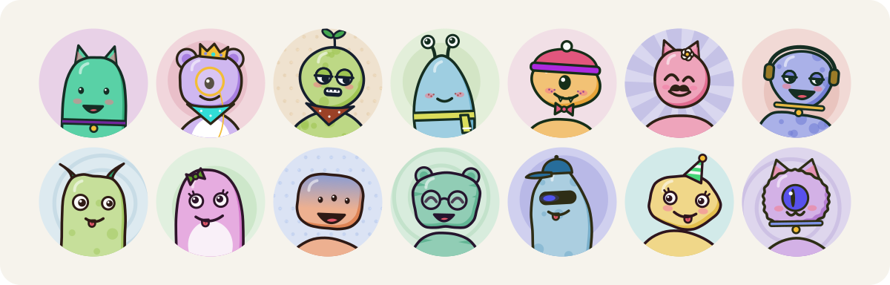
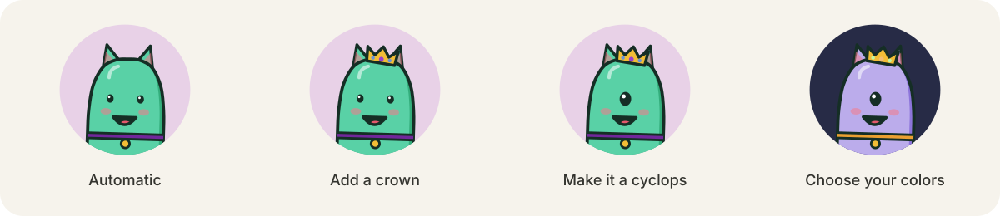

# Monster Avatar

**A little character for every profile.**

Colorful SVG monsters generated from a name or ID. Use them as instant placeholders, or let people choose the details that make an avatar their own.



[Get it on npm](https://www.npmjs.com/package/monster-avatar) · [MIT license](LICENSE) · JavaScript + TypeScript · Zero runtime dependencies

[Quick start](#quick-start) · [Customize](#make-it-yours) · [Save and restore](#save-and-restore) · [API reference](docs/API.md) · [For your agent](#for-your-agent)

## Why Monster Avatar?

- **Recognizable, with room for personality.** Bodies, eyes, mouths, hats, patterns, and accessories share one illustrated style.
- **The same seed brings back the same monster.** No image service, API key, or network request needed to generate it.
- **Automatic until you choose otherwise.** Pick a few traits or colors and let the seed fill in the rest.
- **Works wherever SVG works.** Use an image source in a web app, generate SVG on a server, or save it as a file.
- **Small setup, no framework required.** ESM and CommonJS builds, a browser script, and TypeScript definitions are included.

## Quick start

```sh
npm install monster-avatar
```

```js
import { monsterAvatarDataUri } from 'monster-avatar';

const image = document.createElement('img');
image.src = monsterAvatarDataUri('user_2841', { seedMode: 'raw' });
image.alt = 'Your avatar';
image.width = 64;
image.height = 64;
image.style.borderRadius = '50%';
document.body.append(image);
```

That's it: no account, server, or image files to manage. The result is a normal SVG data URI you can pass to an image's `src` in your preferred framework.

### Use it as a profile fallback

Use an uploaded photo when it exists, and a generated monster otherwise:

```js
const avatarUrl = user.photoUrl || monsterAvatarDataUri(user.id, {
  seedMode: 'raw',
});
```

Use an immutable user ID if the avatar should survive username changes. Pass a string in raw mode, converting numeric IDs with `String(user.id)` if needed.

### Names or IDs?

| Input | Recommended option | What happens |
| --- | --- | --- |
| Display name | Default, or `seedMode: 'name'` | `"  Alice  "` and `"alice"` produce the same avatar. |
| User ID or hash string | `seedMode: 'raw'` | Case and whitespace are preserved exactly. The string must be nonempty. |

A seed gives you repeatability, not a guarantee that every avatar will look unique.

## Make it yours

Start with a seed, then override only the details you want to choose.



```js
import { monsterAvatar } from 'monster-avatar';

const avatar = monsterAvatar('Ian Cheng', {
  traits: {
    hat: 'crown',
    eyes: 'cyclops',
  },
  colors: {
    body: '#bbaceb',
    background: '#272b46',
    accent: '#f1be72',
  },
});

console.log(avatar.svg);    // SVG markup, ready to save or render
console.log(avatar.config); // The choices needed to recreate it
```

Choose body shape, eye layout and style, mouth, top features, hats, face and neck accessories, earrings, patterns, cheeks, and backdrop. Colors support body, accent, background, and outline (`ink`), with matching shades derived automatically.

Leave a field out to make it automatic again. Colors accept `#RGB` or `#RRGGBB`. See the [complete list of traits and options](docs/API.md#traits).

### Build an avatar picker

Use the exported schema to populate your own controls:

```js
import { traitSchema, monsterAvatar } from 'monster-avatar';

const hats = traitSchema.hat.values;
const avatar = monsterAvatar('user_2841', {
  seedMode: 'raw',
  traits: { hat: hats[1] },
});
```

A selected trait takes priority over generated details. Choosing glasses, for example, can adjust automatic eyes to a pair. Two incompatible explicit choices—such as a crown and stalk eyes—throw an error, so your picker can ask the user to change one choice or return it to automatic. Compatibility metadata is available through `traitCompatibility`.

### Shuffle without losing your choices

```js
const seed = crypto.randomUUID();
const avatar = monsterAvatar(seed, {
  seedMode: 'raw',
  traits: { hat: 'beanie' },
});
```

Generate and save the seed once. Use a new seed when the user clicks Shuffle; keep their explicit choices in the options. Don't generate a new seed on every render. For server-rendered apps, pass the same saved seed to the client.

## Save and restore

Store `avatar.config` as JSON alongside the user's profile:

```js
import { monsterAvatar, restoreAvatar } from 'monster-avatar';

const avatar = monsterAvatar('user_2841', {
  seedMode: 'raw',
  traits: { hat: 'beanie' },
});

const saved = JSON.stringify(avatar.config);

// Later, or on another device:
const restored = restoreAvatar(JSON.parse(saved), { size: 128 });
console.log(restored.svg);
```

The configuration stores the seed, generator version, theme, and chosen traits and colors. Save this object rather than the resolved `traits` returned for inspection. Size and inline SVG ID prefixes are presentation settings you can supply when restoring.

Generator versions protect against silently changing a saved avatar's appearance. Unsupported versions are rejected. Keep a compatible renderer, or save the SVG itself when you need permanent, exact preservation.

## Choose your output

| You need… | Use |
| --- | --- |
| An image `src` | `monsterAvatarDataUri(seed, options)` |
| SVG markup or a file | `monsterAvatar(seed, options).svg` |
| Resolved trait values | `monsterTraits(seed, options)` |
| A saved avatar | `restoreAvatar(config, presentation)` |
| Choices for editor controls | `traitSchema` and `traitCompatibility` |

SVGs default to 100 × 100 and scale cleanly. Set `size` for another output size, or size the image with CSS. Apply `border-radius: 50%` to get the round crop shown above.

For ordinary image use, a data URI keeps each avatar's SVG IDs isolated. When inserting multiple SVGs inline, supply a different `idPrefix` for each instance. Add meaningful alternative text in your app; the generator does not know whose avatar it is.

The [API reference](docs/API.md) covers all options, validation, inline IDs, browser support, and import formats.

## Try the editor locally

From a checkout of this repository:

```sh
npm ci
npm run dev
```

Open **http://127.0.0.1:4173** to try the controls, compare small sizes, browse a gallery, and export SVGs or saved configurations.

## For your agent

Give your coding agent [AGENTS.md](AGENTS.md). It includes an integration recipe, the API contracts to preserve, and guidance for working on this repository.

A useful starting prompt:

> Read AGENTS.md, then use monster-avatar for profile-image fallbacks. Keep uploaded photos, seed generated avatars from a stable user ID, and preserve the same seed between server and client.

Point your agent at the local file when working from a checkout, or give it the link to the guide on GitHub.

## Contributing

The renderer lives in `monster-avatar.js`. Generated builds live in `dist/`; edit the source and build them again rather than changing those files directly.

```sh
npm test                  # Generator, customization, and saved configurations
npm run test:types        # ESM and CommonJS TypeScript consumers
npx playwright install chromium
npm run test:browser      # Editor, SVG decoding, and responsive layout
npm run test:package      # Install and verify an actual npm tarball
npm run docs:images       # Regenerate the README showcase from the real API
```

If Chrome is already installed, `PLAYWRIGHT_CHANNEL=chrome npm run test:browser` and `PLAYWRIGHT_CHANNEL=chrome npm run test:package` can use it instead of downloading Chromium. Stop `npm run dev` before running browser tests, which start their own server on port 4173.

Keep default appearances stable: the test suite checks 140 original SVG outputs. See [AGENTS.md](AGENTS.md#working-on-this-repository) for source layout and contributor checks.

## License

[MIT](LICENSE) © 2026 c-jien. Free to use and modify, including in commercial projects.
